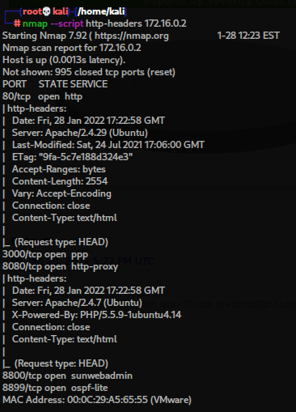

# Отчет по лабораторной работе №3

#### HTB (AdmirerToo) 
nmap

nessus

openvas

sniper

#### vulnhub VPLE (https://www.vulnhub.com/entry/vulnerable-pentesting-lab-environment-1,737/) 
nmap

nessus

openvas

sniper

#### mst 
nmap

nessus

openvas

sniper

